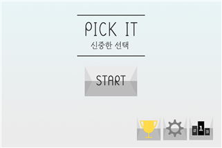
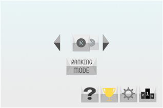
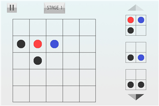

# Logical puzzle game <PICK IT - A deliberate choice>
> <논리 퍼즐 게임 <PICK IT - 신중한 선택>  
강진선, 강현구, 김록기 | 중앙대학교 컴퓨터공학부  
Jinseon Kang, Hyeongoo Kang, Rocky Kim | Dept of Computer Science and Engineering, Chung-Ang University

## 요약
배열과 일치하는 그림을 찾아나가는 퍼즐 게임으로, 터치 앤 드래그 조작을 기본으로 하며 플레이어의 직관력과 함께 논리력을 요구한다. 게임이 진행될수록 어려워지는 난이도를 통해 플레이어의 도전정신을 자극하고 성취감을 느낄 수 있게 하는 데 목적이 있다. 
  
## 등록
[DBpia : 논리 퍼즐 게임 〈PICK IT-신중한 선택〉](https://www.dbpia.co.kr/Journal/articleDetail?nodeId=NODE07182790) 

## 게임 방법
5&#42;5 바둑판 배열에 공들이 제시되면, 측면에 나열된 2&#42;2 배열과 같은 그림을 5&#42;5 배열에서 순서대로 찾아 나가는 퍼즐 게임이다. 플레이어가 5&#42;5 배열을 보고 측면에 나온 2&#42;2 배열과 같은 공이 있는 위치를 터치하면, 1단계 공(검은 공)은 사라지고, 2단계 공(파란 공)은 1단계 공으로 바뀐다. 이런 규칙에 따라 5&#42;5 배열의 공들을 다 제거하는 것이 게임의 목적이다.
  
## 게임 인터페이스
  

	

  메인 화면

	

  모드 선택

	

  플레이 화면

